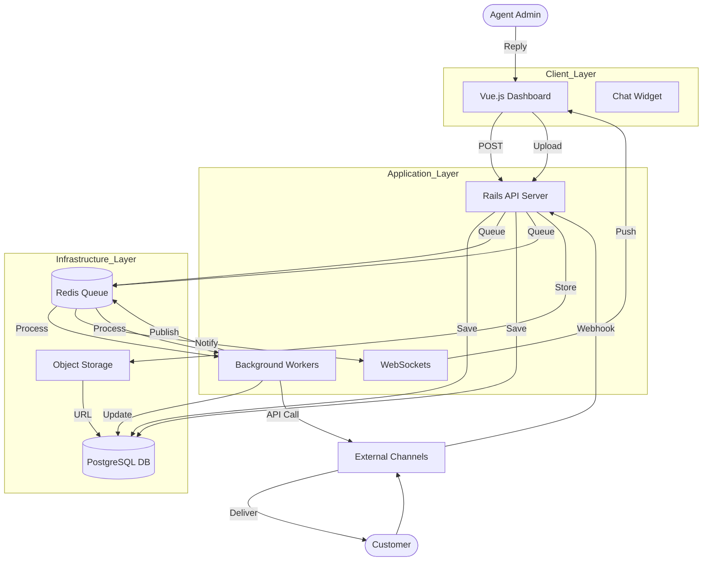
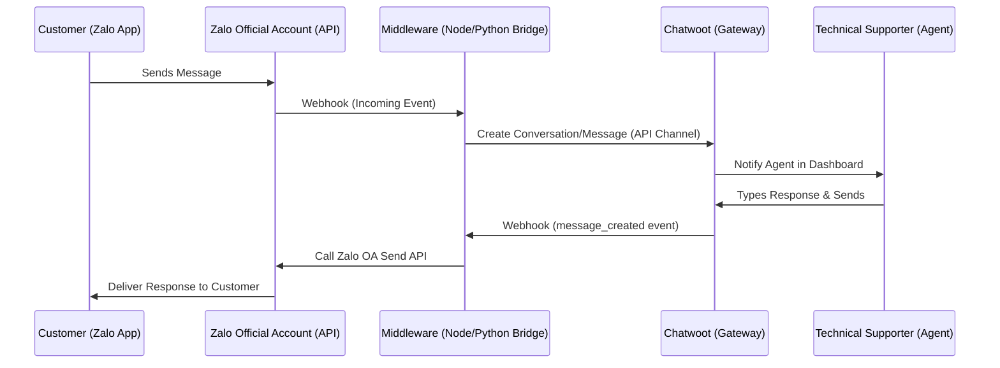
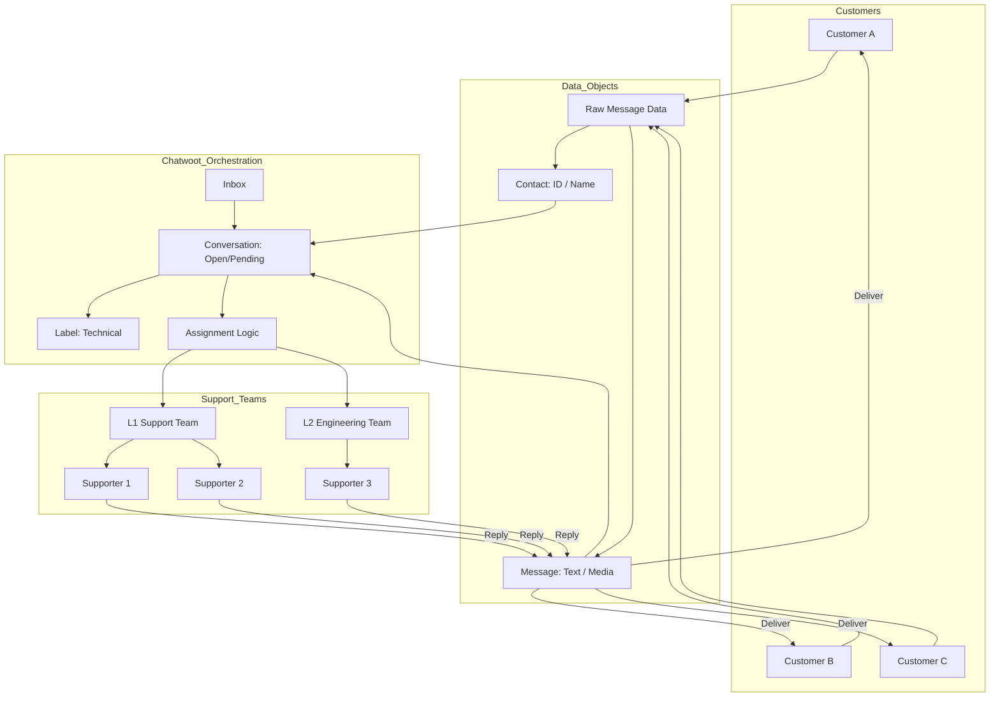
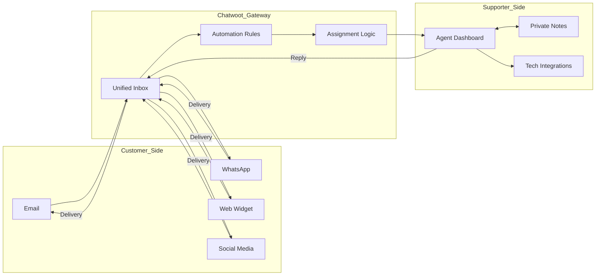
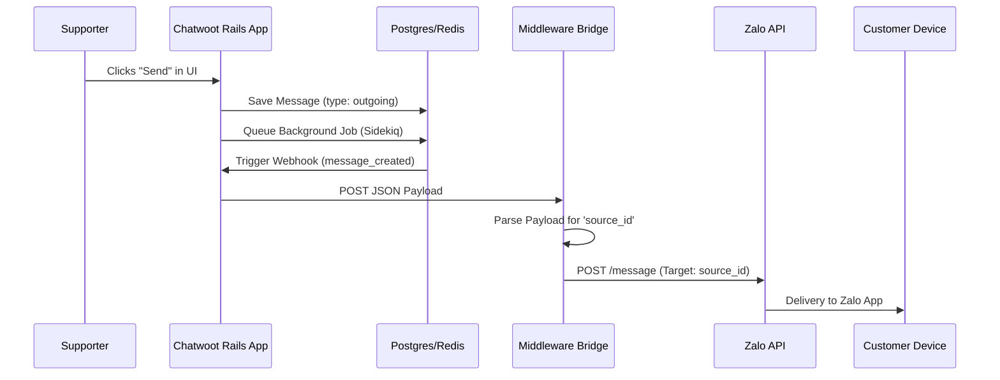

# Chatwoot Dataflow and Architecture

Chatwoot is built on a modern Ruby on Rails and Vue.js stack, utilizing a set of robust services for data persistence, background processing, and real-time communication.

## High-Level Dataflow Diagram

The following diagram illustrates how data flows between the user, the Chatwoot core, and external services.

## Detailed Component Roles

### 1. Web Server (Ruby on Rails)
- Acts as the central hub for all HTTP requests.
- Handles authentication, authorization (CanCanCan), and business logic.
- Exposes RESTful APIs for the Vue.js dashboard.
- Manages incoming webhooks from external channels.

### 2. PostgreSQL
- The primary source of truth for all persistent data.
- Stores: Users, Accounts, Conversations, Messages, Contacts, and Inbox configurations.

### 3. Redis
- **Background Jobs:** Serves as the message broker for Sidekiq.
- **Real-time:** Facilitates the Pub/Sub mechanism for ActionCable (WebSockets).
- **Caching:** Stores session data and temporary application state to improve performance.

### 4. Sidekiq Workers
- Offloads time-consuming tasks from the main request/response cycle.
- Examples: 
  - Sending automated emails.
  - Processing incoming webhooks from social media platforms.
  - Executing automation rules.
  - Triggering outbound webhooks to third-party systems.

### 5. ActionCable (WebSockets)
- Provides full-duplex communication between the backend and frontend.
- Ensures agents see incoming messages and conversation status changes in real-time without refreshing the page.

### 6. Object Storage (S3 / Cloud Storage)
- Stores non-relational assets like:
  - Message attachments (images, documents).
  - User avatars.
  - Account logos.

### 7. External Integrations (Channels)
- Chatwoot connects to various platforms via their official APIs/Webhooks:
  - **Meta:** WhatsApp, Messenger, Instagram.
  - **Email:** IMAP/SMTP or SendGrid/Mailgun.
  - **Others:** SMS (Twilio), Telegram, Line, and the custom Chatwoot Web Widget.

## Zalo to Chatwoot Integration (The Centralized Bridge)

To solve the problem of **"fragmented communication"** (where customers message various supporters separately on personal Zalo accounts), you can implement a centralized Zalo-Chatwoot gateway.

### The Problem: Fragmented Support
- Customers message supporters on personal Zalo IDs.
- No central record of technical issues.
- If a supporter is away, the customer is stuck.
- Knowledge is siloed.

### The Solution: Centralized Zalo Gateway
By using a **Zalo Official Account (OA)** and a **Middleware Bridge**, you funnel everything into Chatwoot.

### How to Implement This:

1.  **Set up a Zalo Official Account (OA):**
    - You must use an OA instead of personal accounts to access the official Messaging APIs.
2.  **Create a "Custom Inbox" in Chatwoot:**
    - Choose the **API Channel** in Chatwoot settings. This gives you a unique `Inbox ID` and `API Token`.
3.  **The Middleware Bridge:**
    - Build a small server (Node.js/Python) that:
        - Listens to webhooks from Zalo.
        - Translates them into Chatwoot API calls (`/api/v1/accounts/{id}/conversations`).
        - Listens to webhooks from Chatwoot when an agent replies.
        - Translates them into Zalo OA Send Message calls.
4.  **Assignment Logic in Chatwoot:**
    - Once in the gateway, you can use **Teams** and **Assignments**.
    - If a technical question comes in, it can be auto-assigned to the "Technical Team" or a specific supporter based on the customer's history.

### Benefits for Technical Supporters:
- **Unified Identity:** The customer sees one professional brand (The Zalo OA) rather than individual accounts.
- **Collaborative Support:** If a supporter is stuck, they can `@mention` a senior developer in a **Private Note** right inside the Zalo conversation.
- **History Tracking:** Any supporter who picks up the chat sees the *entire* history of that customer across all channels.

## Many-to-Many Object Dataflow

This diagram shows how Chatwoot manages the high volume of "Many Customers" to "Many Supporters" by orchestrating specific data objects.

### The Object Lifecycle:

1.  **Contact Object (The 'Who'):**
    - Even if 1,000 customers ask questions, each is uniquely identified as a **Contact**.
    - Metadata (e.g., "Loyalty Tier", "Technical Version") is attached to this object to help supporters prioritize.

2.  **Message Object (The 'What'):**
    - Each piece of text or image becomes a **Message Object**.
    - It is tagged as `incoming` (from customer) or `outgoing` (from supporter).

3.  **Conversation Object (The 'Context'):**
    - This is the most critical object. It groups multiple **Messages** from one **Contact** into a single thread.
    - It has a `status` (Open, Snoozed, Resolved). This prevents "Many Supporters" from overlapping on the same issue.

4.  **Assignment Object (The 'Who Handles'):**
    - The gateway maps a **Conversation** to an **Agent** or a **Team**.
    - This ensures that while there are "many supporters," only *one* responsible person is driving the resolution at any given time, preventing duplicate replies.

5.  **Label Object (The 'Triage'):**
    - Labels like `#Bug`, `#FeatureRequest`, or `#Priority1` allow technical supporters to filter the "Many Conversations" and focus on what matters most.

## Chatwoot as a Communication Gateway

When viewed as a gateway, Chatwoot acts as the central bridge between diverse customer entry points and the specialized technical support environment.

### The Gateway Functions:

1. **Aggregation (The Funnel):**
   - It abstracts the complexity of different communication protocols. Whether a customer uses a proprietary API (WhatsApp) or a legacy one (Email), the technical supporter sees a unified interface.

2. **Contextualization:**
   - As a gateway, it doesn't just pass messages; it attaches context. It identifies the customer, shows their previous technical issues, and pulls metadata (like browser version or account tier) to help the supporter.

3. **Routing & Triage:**
   - Technical queries can be automatically routed to specific "Teams" (e.g., L2 Support, DevOps, Billing) based on keywords, the source inbox, or previous interaction history.

4. **Internal-External Separation:**
   - It provides a "safe space" for technical supporters to collaborate. Using **Private Notes**, a supporter can discuss a bug with a developer inside the conversation without the customer seeing the internal technical jargon or debugging steps.

5. **External Tooling Bridge:**
   - It acts as a gateway to other technical tools. A supporter can trigger a webhook to a bug tracker (Jira/GitHub) directly from the conversation, linking the customer's report to the technical task.

## Technical Delivery Mechanism: "How the right message reaches the right customer"

The mechanism for delivering a reply from a supporter back to a customer depends on **Context Binding** within Chatwoot's database.

### 1. The Context Chain
When a supporter types a reply and clicks "Send", Chatwoot follows this internal chain:
1.  **Identify the Conversation:** The UI is locked to a specific `conversation_id`.
2.  **Retrieve the Contact:** The `conversation` object is linked to a `contact` object.
3.  **Find the Source ID:** The `contact` has a `contact_inboxes` entry which stores the `source_id` (e.g., the specific Zalo User ID or Email address).
4.  **Select the Channel:** The `conversation` is linked to an `inbox`, which contains the API credentials (tokens) for that specific channel.

### 2. The Delivery Flow (Zalo Example)

### 3. Key Components of the Mechanism

*   **Webhook Payload:** When a supporter replies, Chatwoot sends a JSON payload to your middleware. Crucially, this payload includes:
    *   `content`: The text the supporter wrote.
    *   `source_id`: The external ID of the customer (e.g., `Zalo-User-123`).
    *   `inbox_id`: To know which Zalo OA should send the message.
*   **Reliability (Sidekiq):** If the Zalo API is down, the Middleware can return an error. Chatwoot's background workers can then retry the delivery or mark the message as "Failed to send" in the dashboard so the supporter knows.
*   **State Management:** Once delivered, the message status is updated in Chatwoot's PostgreSQL database to ensure the UI shows a "Sent" or "Delivered" state.

This mechanism ensures that even if you have 1,000 active conversations, the **Source ID** always acts as the "postal address" that routes the supporter's reply back to the specific customer.
